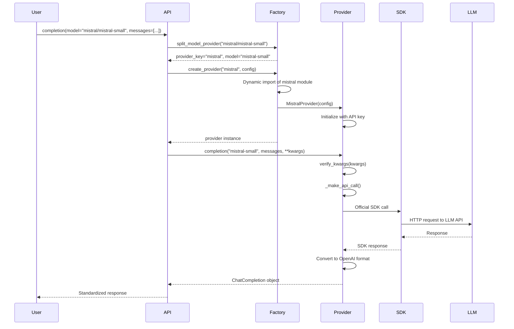
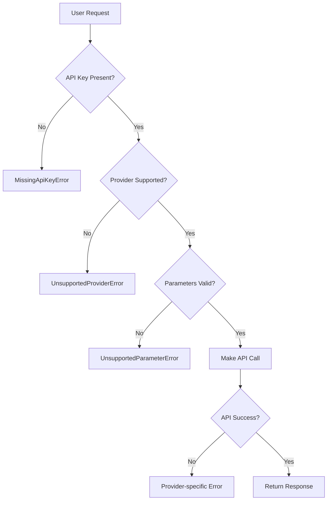
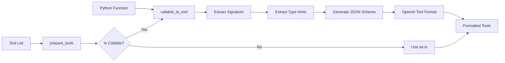

# omni-llm: Comprehensive Documentation

## Executive Summary

`omni-llm` is a Python SDK that provides a unified interface for interacting with multiple Large Language Model (LLM) providers. It acts as an abstraction layer that normalizes the differences between various LLM APIs while leveraging official provider SDKs for maximum compatibility and reliability.

## Table of Contents

1. [Architecture Overview](#architecture-overview)
2. [Data Flow Analysis](#data-flow-analysis)
3. [Core Components](#core-components)
4. [Features List](#features-list)
5. [Unique Selling Points (USPs)](#unique-selling-points-usps)
6. [Limitations](#limitations)
7. [Provider Implementation Details](#provider-implementation-details)
8. [Technical Deep Dive](#technical-deep-dive)
9. [Testing Strategy](#testing-strategy)
10. [Security Considerations](#security-considerations)

## Architecture Overview

### High-Level Architecture

```
┌─────────────────────────────────────────────────────────────────────┐
│                          User Application                           │
└────────────────────────────────┬───────────────────────────────────┘
                                 │
                                 ▼
┌─────────────────────────────────────────────────────────────────────┐
│                         omni-llm SDK API                             │
│  ┌─────────────────┐  ┌─────────────────┐  ┌─────────────────┐    │
│  │  completion()   │  │  acompletion()  │  │  verify_kwargs()│    │
│  └────────┬────────┘  └────────┬────────┘  └────────┬────────┘    │
│           │                    │                     │              │
│           └────────────────────┴─────────────────────┘              │
│                               │                                      │
│                               ▼                                      │
│  ┌─────────────────────────────────────────────────────────────┐   │
│  │                    Provider Factory                          │   │
│  │  - Dynamic provider loading                                  │   │
│  │  - Provider validation                                       │   │
│  │  - Model/provider splitting                                  │   │
│  └─────────────────────────────┬───────────────────────────────┘   │
└────────────────────────────────┼───────────────────────────────────┘
                                 │
                                 ▼
┌─────────────────────────────────────────────────────────────────────┐
│                        Provider Implementations                      │
│  ┌──────────┐  ┌──────────┐  ┌──────────┐  ┌──────────┐          │
│  │ OpenAI   │  │Anthropic │  │ Mistral  │  │  Google  │  ...     │
│  │ Provider │  │ Provider │  │ Provider │  │ Provider │          │
│  └────┬─────┘  └────┬─────┘  └────┬─────┘  └────┬─────┘          │
│       │              │              │              │                │
└───────┼──────────────┼──────────────┼──────────────┼───────────────┘
        │              │              │              │
        ▼              ▼              ▼              ▼
┌─────────────┐ ┌─────────────┐ ┌─────────────┐ ┌─────────────┐
│ OpenAI SDK  │ │Anthropic SDK│ │ Mistral SDK │ │ Google SDK  │
└─────────────┘ └─────────────┘ └─────────────┘ └─────────────┘
```

### Component Hierarchy

```
src/omni_llm/
├── __init__.py         # Public API exports
├── api.py              # Main completion functions
├── provider.py         # Provider base class & factory
├── exceptions.py       # Custom exceptions
├── logging.py          # Rich logging setup
├── tools.py            # Tool/function calling utilities
└── providers/          # Provider implementations
    ├── helpers.py      # Common utilities
    ├── openai/         # OpenAI & compatible providers
    ├── anthropic/      # Anthropic Claude
    ├── mistral/        # Mistral AI
    ├── google/         # Google Gemini
    └── ... (20+ providers)
```

## Data Flow Analysis

### 1. Request Flow



### 2. Error Handling Flow



### 3. Tool Calling Flow



## Core Components

### 1. API Module (`api.py`)

**Purpose**: Main entry point for SDK functionality

**Key Functions**:
- `completion()`: Synchronous completion API
- `acompletion()`: Asynchronous completion API
- `verify_kwargs()`: Parameter validation
- `_prepare_completion_request()`: Request preparation logic

**Design Patterns**:
- Facade pattern for unified interface
- Parameter normalization
- Async/sync dual support

### 2. Provider System (`provider.py`)

**Purpose**: Abstract provider interface and factory

**Key Classes**:
- `Provider`: Abstract base class for all providers
- `ProviderFactory`: Dynamic provider loading
- `ProviderName`: Enum of supported providers
- `ApiConfig`: Configuration model

**Design Patterns**:
- Factory pattern for provider creation
- Strategy pattern for provider implementations
- Dynamic module loading

### 3. Exception System (`exceptions.py`)

**Purpose**: Structured error handling

**Exception Types**:
- `MissingApiKeyError`: API key not found
- `UnsupportedProviderError`: Invalid provider
- `UnsupportedParameterError`: Parameter not supported

**Benefits**:
- Clear error messages
- Actionable guidance
- Consistent error handling

### 4. Tool System (`tools.py`)

**Purpose**: Function calling support

**Key Functions**:
- `callable_to_tool()`: Convert Python functions to tool schemas
- `prepare_tools()`: Process mixed tool formats
- `_python_type_to_json_schema_type()`: Type conversion

**Features**:
- Automatic schema generation
- Type hint support
- Mixed format handling

## Features List

### Core Features

1. **Unified Interface**
   - Single API for 20+ LLM providers
   - Consistent parameter names
   - Standardized response format (OpenAI ChatCompletion)

2. **Provider Support**
   - OpenAI (GPT-3.5, GPT-4, etc.)
   - Anthropic (Claude 3, Claude 3.5)
   - Google (Gemini Pro, Gemini Ultra)
   - Mistral AI
   - Meta/Hugging Face
   - AWS Bedrock
   - Azure OpenAI
   - 13+ additional providers

3. **Async/Sync Support**
   - Both `completion()` and `acompletion()`
   - Thread-safe async implementation
   - Streaming support

4. **Tool/Function Calling**
   - Convert Python functions to tools
   - Support for OpenAI tool format
   - Mixed format handling

5. **Structured Output**
   - Response format support via Instructor
   - Pydantic model integration
   - JSON schema validation

6. **Configuration Management**
   - Environment variable support
   - Runtime API key injection
   - Custom base URLs

7. **Type Safety**
   - Full type hints
   - Mypy strict mode
   - Runtime validation

8. **Logging**
   - Rich console output
   - Configurable log levels
   - Structured logging

### Advanced Features

1. **Dynamic Provider Loading**
   - No hardcoded provider imports
   - Lazy loading for performance
   - Extensible architecture

2. **Provider-Specific Features**
   - Instructor integration (Anthropic, Cerebras, etc.)
   - Custom parameter mapping
   - Provider-specific optimizations

3. **Error Recovery**
   - Graceful degradation
   - Clear error messages
   - Fallback strategies

4. **Testing Infrastructure**
   - Unit tests
   - Integration tests
   - Mock providers

## Unique Selling Points (USPs)

### 1. **Leverages Official SDKs**
Unlike competitors that reimplement provider APIs, omni-llm uses official SDKs:
- **Benefit**: Maximum compatibility
- **Benefit**: Automatic updates
- **Benefit**: Provider-tested code

### 2. **True Unified Interface**
Not just a wrapper, but a normalization layer:
- Consistent parameter names across providers
- Unified response format
- Seamless provider switching

### 3. **Framework Agnostic**
Works with any Python framework:
- No dependencies on specific frameworks
- Clean, minimal API
- Easy integration

### 4. **Type-First Design**
Built with type safety in mind:
- Full type hints
- Mypy strict mode
- IDE autocomplete support

### 5. **Production Ready**
Used in Mozilla AI's production systems:
- Battle-tested code
- Active maintenance
- Real-world usage

### 6. **Smart Tool Conversion**
Automatic Python function to tool conversion:
- No manual schema writing
- Type hint awareness
- Docstring parsing

### 7. **Flexible Installation**
Install only what you need:
```bash
pip install 'omni-llm-sdk[mistral,anthropic]'  # Specific providers
pip install 'omni-llm-sdk[all]'                 # All providers
```

## Limitations

### 1. **Provider Feature Parity**
- Not all providers support all features
- Streaming not available for all providers
- Tool calling varies by provider

### 2. **Response Format Limitations**
- Forces OpenAI ChatCompletion format
- May lose provider-specific metadata
- Some providers have richer responses

### 3. **Performance Overhead**
- Dynamic import adds startup time
- Response conversion adds latency
- Memory overhead from normalization

### 4. **Dependency Management**
- Many optional dependencies
- Version conflicts possible
- Large install size with `[all]`

### 5. **Provider API Changes**
- Dependent on provider SDK updates
- Breaking changes in provider APIs
- Lag in supporting new features

### 6. **Limited Provider Customization**
- Abstracts away provider-specific features
- May not expose all provider options
- Generic interface limitations

### 7. **Error Message Abstraction**
- Provider-specific errors normalized
- May lose detailed error context
- Debugging can be harder

### 8. **No Built-in Retry Logic**
- No automatic retry on failures
- No rate limiting handling
- No built-in backoff strategies

### 9. **Limited Observability**
- No built-in metrics
- No request tracing
- Limited debugging hooks

### 10. **Model Management**
- No model availability checking
- No cost estimation
- No model capability detection

## Provider Implementation Details

### Provider Categories

1. **OpenAI-Compatible Providers**
   - Base class: `BaseOpenAIProvider`
   - Examples: OpenAI, XAI, Nebius, Moonshot
   - Minimal implementation needed

2. **Custom SDK Providers**
   - Direct SDK integration
   - Examples: Anthropic, Google, Mistral
   - Response conversion required

3. **Instructor-Enhanced Providers**
   - Structured output support
   - Examples: Anthropic, Cerebras, Groq
   - Additional dependency

### Provider Implementation Pattern

```python
class ExampleProvider(Provider):
    PROVIDER_NAME = "Example"
    ENV_API_KEY_NAME = "EXAMPLE_API_KEY"
    PROVIDER_DOCUMENTATION_URL = "https://example.com/docs"
    
    def verify_kwargs(self, kwargs: dict[str, Any]) -> None:
        # Validate provider-specific parameters
        pass
    
    def _make_api_call(self, model: str, messages: list[dict[str, Any]], **kwargs: Any):
        # 1. Create SDK client
        # 2. Convert parameters if needed
        # 3. Make API call
        # 4. Convert response to OpenAI format
        # 5. Return ChatCompletion
        pass
```

## Technical Deep Dive

### 1. Dynamic Import System

The `ProviderFactory` uses Python's `importlib` for dynamic loading:

```python
module = importlib.import_module(f"omni_llm.providers.{provider_name}")
provider_class = getattr(module, f"{provider_name.capitalize()}Provider")
```

Benefits:
- No unused imports
- Faster startup
- Extensible architecture

### 2. Response Normalization

All providers convert responses to OpenAI's `ChatCompletion` format:

```python
ChatCompletion(
    id="provider-specific-id",
    model="model-name",
    object="chat.completion",
    created=timestamp,
    choices=[Choice(...)],
    usage=CompletionUsage(...)
)
```

### 3. Parameter Mapping

Providers handle parameter differences:
- `max_tokens` vs `max_output_tokens`
- `stop` vs `stop_sequences`
- Provider-specific parameters

### 4. Streaming Implementation

Streaming responses are wrapped in OpenAI's `Stream` type:
- Consistent iteration interface
- Automatic cleanup
- Error handling

### 5. Type System

Extensive use of Python typing:
- Generic types for streaming
- Union types for flexibility
- Protocol types for duck typing

## Testing Strategy

### 1. Unit Tests
- Provider factory tests
- API signature tests
- Tool conversion tests
- Exception handling tests

### 2. Integration Tests
- Real API calls (with API keys)
- Provider-specific features
- Error scenarios
- Response validation

### 3. Test Infrastructure
- pytest framework
- Mock providers
- Fixture system
- Coverage tracking

## Security Considerations

### 1. API Key Management
- Environment variable support
- No hardcoded keys
- Clear key naming

### 2. Request Validation
- Parameter sanitization
- Type checking
- Size limits

### 3. Error Information
- No sensitive data in errors
- Clear but safe messages
- Proper exception handling

### 4. Dependency Security
- Regular updates
- Minimal dependencies
- Official SDKs only

## Conclusion

`omni-llm` represents a well-architected solution to the LLM provider fragmentation problem. By leveraging official SDKs and providing a unified interface, it offers a production-ready abstraction layer that simplifies multi-provider LLM integration while maintaining flexibility and performance.

The library's strength lies in its clean architecture, comprehensive provider support, and thoughtful design decisions that prioritize developer experience without sacrificing functionality.